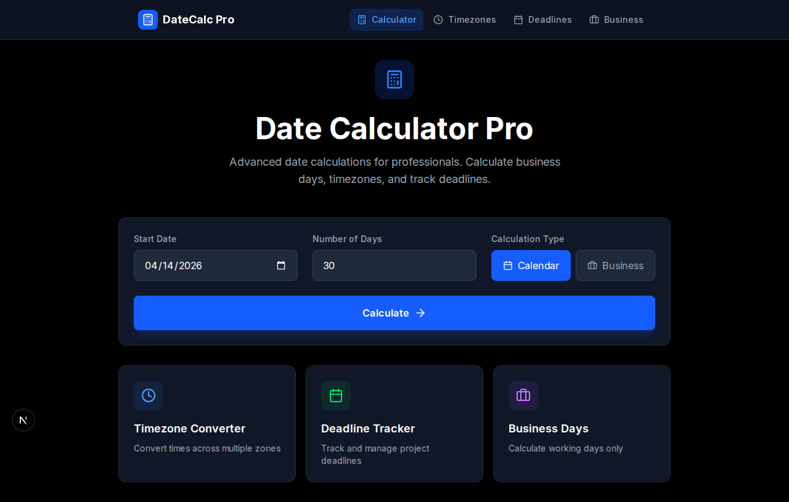

# Date Calculator Pro

Advanced date and time calculation tool for professionals. Calculate business days, convert timezones, and track project deadlines.



## Features

### 📅 Date Calculator (`/`)
- Add/subtract calendar or business days
- Visual breakdown of total/business/weekend days
- Quick links to other tools

### 🌍 Timezone Converter (`/timezones`)
- Convert across 9 major timezones
- Real-time conversion with base timezone selector
- Visual timezone cards

### 📋 Deadline Tracker (`/deadlines`)
- Add, edit, and delete deadlines
- Priority levels (high/medium/low)
- Days remaining calculation with status indicators
- **localStorage persistence** - your deadlines persist across sessions
- Completion tracking

### 💼 Business Days (`/business`)
- Quick reference for common business day calculations
- 5/10/30/45/60 business day lookup
- Calendar day equivalents

## Tech Stack

- **Framework:** Next.js 16 (App Router, TypeScript)
- **Styling:** Tailwind CSS
- **Date Library:** date-fns
- **Icons:** Lucide React
- **Deployment:** Vercel

## Design

- **Primary Color:** Blue (#3B82F6)
- **Theme:** Dark mode professional tool aesthetic
- **UI Components:** CalculatorCard, ResultDisplay, Navbar

## Getting Started

```bash
npm install
npm run dev
```

Open [http://localhost:3000](http://localhost:3000)

## Build

```bash
npm run build
```

Static export ready for deployment.

## Live Demo

https://date-calculator-pro.vercel.app

## License

MIT
